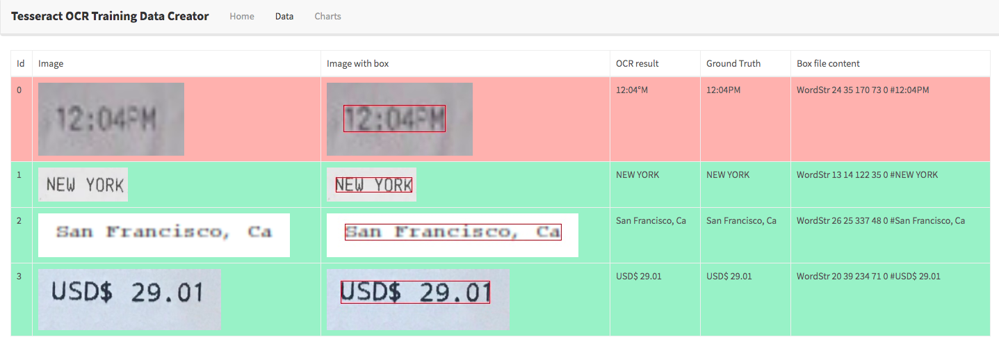

# ocr-box-editor-v2
* This is a web application to generate training data for tesseract by the following steps
  * Upload images 
  * Edit labels for the uploaded images (text and bounding box coordinates)
  * Save images and corresponding labels to backend
* After we collect training data, we can retrain tesseract 

## prerequisite
* install `tesseract`
* install `python3` and `virtualenv`

## How to install
```
virtualenv venv
source venv/bin/activate
pip3 install -r requirements.txt 
```

## How to run
```
python3 manage.py migrate
python3 manage.py runserver
```

`db.sqlite3` will be created, and then, we can access `http://127.0.0.1:8000`

## Editor
* Upload images and click `Process Image` button to generate default labels
* Edit labels for the uploaded images (text and bounding box coordinates)
* Save images and corresponding labels (in `.box` file extension) to backend


## Data Viewer
* We can see all uploaded images in the backend by clicking `Data` tab


